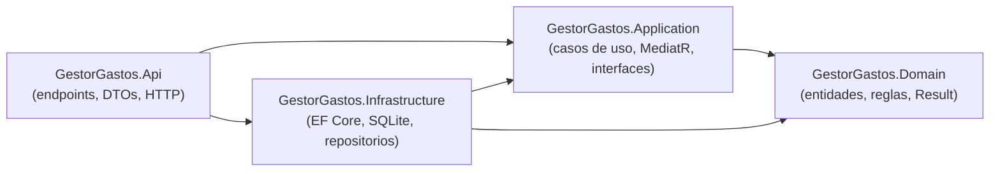
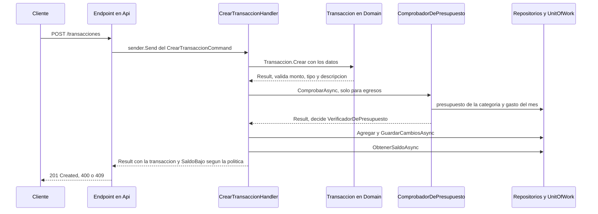

# GestorGastos

API REST para llevar el control de ingresos y gastos personales: registra transacciones, calcula el saldo, resume el gasto por categoría y aplica **presupuestos mensuales** que rechazan los egresos que se pasan del límite.

Además de ser una API funcional, el proyecto es un **ejercicio de aprendizaje de patrones de diseño**: cada patrón se fue incorporando por separado, en orden, con su propio commit y su propia batería de pruebas. Este documento explica qué hay, por qué está así y cómo trabajar con ello.

## Contenido

1. [Resumen](#resumen)
2. [Tecnologías](#tecnologías)
3. [Arquitectura](#arquitectura)
4. [Patrones y conceptos aplicados](#patrones-y-conceptos-aplicados)
5. [Reglas de negocio](#reglas-de-negocio)
6. [Referencia de la API](#referencia-de-la-api)
7. [Modelo de datos](#modelo-de-datos)
8. [Configuración](#configuración)
9. [Cómo ejecutarlo](#cómo-ejecutarlo)
10. [Pruebas](#pruebas)
11. [Calidad de código y estilo](#calidad-de-código-y-estilo)
12. [Datos de ejemplo](#datos-de-ejemplo)
13. [Decisiones de diseño y deudas conocidas](#decisiones-de-diseño-y-deudas-conocidas)
14. [Estructura del repositorio](#estructura-del-repositorio)
15. [Cómo se construyó](#cómo-se-construyó)

---

## Resumen

| | |
|---|---|
| **Qué hace** | Transacciones (ingresos y egresos) con categoría, saldo total, resumen por categoría y presupuestos mensuales por categoría. |
| **Tipo** | API REST con minimal API de ASP.NET Core, documentada con OpenAPI y Swagger UI (solo en desarrollo). |
| **Persistencia** | SQLite mediante Entity Framework Core, con migraciones. |
| **Arquitectura** | Clean Architecture en cuatro proyectos, con CQRS sobre MediatR. |
| **Pruebas** | 240 pruebas automáticas en tres proyectos: unitarias, de integración y de arquitectura. |

**Reglas que conviene tener presentes desde el principio**

- Un **egreso** puede devolver `saldoBajo: true` cuando deja el saldo por debajo de un umbral (100 por defecto, configurable).
- Un **egreso** que haría superar el presupuesto mensual de su categoría se **rechaza** con `409`.
- Los errores esperados del negocio **no son excepciones**: se modelan con el patrón `Result`.

---

## Tecnologías

| Área | Tecnología | Versión |
|---|---|---|
| Plataforma | .NET / ASP.NET Core | `net10.0` (SDK 10.0.x) |
| Acceso a datos | Entity Framework Core + SQLite | 10.0.12 |
| Mensajería interna | MediatR | **12.5.0** (ver [decisiones](#decisiones-de-diseño-y-deudas-conocidas)) |
| Documentación de la API | Microsoft.AspNetCore.OpenApi y Swashbuckle (Swagger UI) | 10.0.12 y 10.2.3 |
| Pruebas | xUnit, Microsoft.AspNetCore.Mvc.Testing | 2.9.3 y 10.0.12 |
| Formato | CSharpier (herramienta local) | 1.3.0 |
| Scripts auxiliares | Python 3 (solo biblioteca estándar) | probado con 3.10 |

---

## Arquitectura

El proyecto sigue **Clean Architecture**: cuatro proyectos y una única dirección de dependencias. Lo más interno (`Domain`) no conoce nada de lo externo.



| Proyecto | Responsabilidad | Depende de |
|---|---|---|
| `GestorGastos.Domain` | Entidades (`Transaccion`, `Presupuesto`), reglas de negocio, `Result` y errores, servicio de dominio y políticas. **Sin ninguna dependencia** (ni siquiera paquetes). | nada |
| `GestorGastos.Application` | Casos de uso (commands y queries con MediatR), contratos de acceso a datos (`ITransaccionRepository`, `ITransaccionConsultas`, `IPresupuestoRepository`, `IPresupuestoConsultas`, `IUnitOfWork`) y servicios de aplicación. | Domain |
| `GestorGastos.Infrastructure` | Implementación de los contratos con EF Core y SQLite, `DbContext`, configuración de entidades y migraciones. | Application, Domain |
| `GestorGastos.Api` | Raíz de composición: registra los servicios, define los endpoints, traduce `Result` a respuestas HTTP. **No contiene reglas de negocio.** | Application, Infrastructure |

Estas reglas no son solo una convención: las **verifican pruebas automáticas** (`ArquitecturaTests`), de modo que una dependencia indebida rompe la compilación de las pruebas.

### Recorrido de una petición

Así viaja un `POST /transacciones`:



---

## Patrones y conceptos aplicados

| Patrón o concepto | Dónde verlo | Para qué sirve aquí |
|---|---|---|
| **Clean Architecture** | Los cuatro proyectos; `ArquitecturaTests` | Dependencias en una sola dirección; el núcleo no conoce EF, HTTP ni MediatR. |
| **DDD "lite": entidad rica** | `Transaccion`, `Presupuesto` | Constructor y setters privados; se crean con `Crear(...)` y se modifican con `Actualizar(...)` o `CambiarLimite(...)`. Las invariantes viven en la entidad y es imposible construir una inválida desde fuera. |
| **Repository** | `ITransaccionRepository`, `IPresupuestoRepository` | Aísla el acceso a datos tras una abstracción; los handlers no conocen EF. |
| **Unit of Work** | `IUnitOfWork` | Los repositorios solo *registran* cambios y la unidad de trabajo los *confirma* juntos, de modo que varios repositorios comparten una misma transacción. |
| **CQRS** | `Application/Transacciones/*`, `Application/Presupuestos/*` | Un caso de uso por carpeta: commands (cambian estado) y queries (solo leen), cada uno con su handler. |
| **Mediator (MediatR)** | `ISender` en los endpoints | Los endpoints solo envían un mensaje; no conocen al handler. |
| **Result** | `Domain/Common/Result.cs`, `ErrorNegocio` | Los fallos esperados (validación, no encontrado, conflicto) son valores, no excepciones. La firma dice que la operación puede fallar. |
| **Servicio de dominio** | `VerificadorDePresupuesto` | Una regla que involucra a dos entidades (`Presupuesto` y `Transaccion`). Es pura: recibe los datos y decide, sin consultar nada. |
| **Servicio de aplicación** | `ComprobadorDePresupuesto` | Orquesta la parte con entrada y salida: busca el presupuesto y el gasto del mes y se los entrega al servicio de dominio. |
| **Política / Strategy** | `IPoliticaDeSaldoBajo`, `PoliticaDeUmbralFijo` | La regla de "saldo bajo" se puede cambiar sin tocar el handler (principio abierto/cerrado). |
| **Segregación de interfaces** | `ITransaccionRepository` y `IPresupuestoRepository` (escritura) frente a `ITransaccionConsultas` y `IPresupuestoConsultas` (lectura) | Cada handler depende solo de los métodos que usa. Lo vigila una prueba de arquitectura. |
| **Paginación** | `Paginacion`, `ResultadoPaginado<T>`, `TransaccionConsultas.ListarAsync` | El listado devuelve una página con sus totales; el orden determinista y el tope de tamaño evitan resultados inconsistentes y consultas abusivas. |
| **Configuración externa** | `Negocio:UmbralSaldoBajo` | El umbral llega desde `appsettings.json` o variables de entorno; un valor inválido impide arrancar. |
| **Pruebas con dobles escritos a mano** | `Application.Tests/Fakes` | Repositorios y unidad de trabajo falsos en memoria; sin librerías de mocks. |

### Servicio de dominio frente a servicio de aplicación

Es una distinción útil y fácil de confundir:

- `VerificadorDePresupuesto` **decide** (dominio): dado un presupuesto, lo gastado en el mes y una transacción, responde si cabe. No tiene dependencias, por eso es estático.
- `ComprobadorDePresupuesto` **busca los datos y llama al verificador** (aplicación): conoce los repositorios.

### Por qué `Actualizar` valida con una transacción candidata

Al actualizar una transacción, el handler primero crea una **candidata** con los datos nuevos para validarla y comprobar el presupuesto, y solo si todo está bien modifica la entidad real. Así, si algo falla, la entidad que EF Core está siguiendo nunca queda modificada a medias. La transacción que se actualiza también se **excluye** del gasto del mes, porque ya estaba contada con su valor anterior.

---

## Reglas de negocio

### Transacciones

| Regla | Detalle |
|---|---|
| Monto | Debe ser mayor a cero. |
| Tipo | `Ingreso` o `Egreso`; cualquier otro valor es inválido. |
| Descripción | Obligatoria (no puede estar vacía ni ser solo espacios). |
| Categoría | Opcional; si falta se asigna `Otros`. |
| Orden de validación | Monto, tipo, descripción; se informa solo el primer error. |
| Saldo | Suma de ingresos menos suma de egresos. |

Categorías: `Alimentacion`, `Transporte`, `Vivienda`, `Servicios`, `Salud`, `Entretenimiento`, `Educacion`, `Salario`, `Otros`.

### Aviso de saldo bajo

Al crear un **egreso**, la respuesta incluye `saldoBajo: true` si el saldo resultante queda **estrictamente por debajo** del umbral (100 por defecto). Quedar exactamente en el umbral no avisa, y un ingreso nunca avisa. El umbral es configurable (ver [Configuración](#configuración)).

### Presupuestos

| Regla | Detalle |
|---|---|
| Alcance | Un límite **mensual** por categoría, recurrente. Como máximo uno por categoría. |
| Límite | Debe ser mayor a cero. |
| `Salario` | No se puede presupuestar, porque es una fuente de ingresos. |
| Duplicado | Un segundo presupuesto para la misma categoría responde `409`. Un índice único en la base de datos lo garantiza incluso con peticiones simultáneas. |

### Límite del presupuesto mensual

Se aplica al **crear y al actualizar** una transacción:

- Solo cuentan los **egresos**; los ingresos nunca se verifican ni consumen presupuesto.
- El gasto se calcula por **categoría** y por **mes calendario** de la fecha de la transacción. Lo gastado en otros meses no cuenta.
- Si `gastado en el mes + monto > límite`, el egreso se rechaza con `409`. **Llegar exactamente al límite se permite.**
- Una categoría sin presupuesto no tiene límite.
- Bajar un límite por debajo de lo ya gastado no borra nada, pero bloquea los egresos nuevos.

---

## Referencia de la API

Con la API en marcha en desarrollo, Swagger UI está en `/swagger` y el documento OpenAPI en `/openapi/v1.json`. Los enums viajan como **texto** (`"Egreso"`, `"Alimentacion"`).

### Transacciones

| Método y ruta | Descripción | Respuestas |
|---|---|---|
| `POST /transacciones` | Crea una transacción. | `201` con `Location` y el cuerpo (incluye `saldoBajo`), `400` validación, `409` presupuesto excedido |
| `GET /transacciones` | Lista **paginada**, de la más reciente a la más antigua. Filtros opcionales: `desde`, `hasta` (día completo incluido) y `categoria`. Paginación: `pagina` (por defecto 1) y `tamanoPagina` (por defecto 20, máximo 100). Ver [Paginación](#paginación). | `200`, `400` paginación inválida |
| `GET /transacciones/{id}` | Una transacción. | `200`, `404` |
| `PUT /transacciones/{id}` | Reemplaza los datos. | `204`, `400`, `404`, `409` |
| `DELETE /transacciones/{id}` | Elimina. | `204`, `404` |
| `GET /transacciones/saldo` | Saldo total: `{ "saldo": 577.57 }`. | `200` |
| `GET /transacciones/resumen` | Totales de ingresos y egresos por categoría, ordenado por categoría. | `200` |

### Presupuestos

| Método y ruta | Descripción | Respuestas |
|---|---|---|
| `POST /presupuestos` | Crea un presupuesto. | `201`, `400`, `409` (ya existe) |
| `GET /presupuestos` | Lista ordenada por categoría. | `200` |
| `GET /presupuestos/{id}` | Uno. | `200`, `404` |
| `PUT /presupuestos/{id}` | Cambia el límite mensual. | `204`, `400`, `404` |
| `DELETE /presupuestos/{id}` | Elimina. | `204`, `404` |

### Ejemplos

```bash
# Crear un ingreso
curl -X POST http://localhost:5007/transacciones -H "Content-Type: application/json" \
  -d '{"descripcion":"Sueldo","monto":2500,"tipo":"Ingreso","categoria":"Salario","fecha":"2026-09-05T09:00:00"}'

# Crear un presupuesto de 450 al mes para Alimentacion
curl -X POST http://localhost:5007/presupuestos -H "Content-Type: application/json" \
  -d '{"categoria":"Alimentacion","limiteMensual":450}'

# Un egreso que se pasa del presupuesto
curl -X POST http://localhost:5007/transacciones -H "Content-Type: application/json" \
  -d '{"descripcion":"Supermercado","monto":500,"tipo":"Egreso","categoria":"Alimentacion","fecha":"2026-09-10T18:00:00"}'

# Filtrar por categoría y rango de fechas
curl "http://localhost:5007/transacciones?categoria=Salud&desde=2026-09-01&hasta=2026-09-30"

# Segunda página, de 10 en 10
curl "http://localhost:5007/transacciones?pagina=2&tamanoPagina=10"
```

Respuesta de un `POST /transacciones` correcto:

```json
{
  "id": "4af29467-01bf-4771-96c5-df0c59d9e870",
  "descripcion": "Sueldo",
  "monto": 2500,
  "tipo": "Ingreso",
  "categoria": "Salario",
  "fecha": "2026-09-05T09:00:00",
  "saldoBajo": false
}
```

### Paginación

Solo `GET /transacciones` está paginado: es el único listado que puede crecer sin límite. Los presupuestos son como máximo uno por categoría (8 filas), así que `GET /presupuestos` sigue devolviendo un arreglo simple.

```json
{
  "items": [ { "id": "4af29467-...", "descripcion": "Sueldo", "monto": 2500, "tipo": "Ingreso", "categoria": "Salario", "fecha": "2026-09-05T09:00:00", "saldoBajo": false } ],
  "pagina": 1,
  "tamanoPagina": 20,
  "total": 116,
  "totalPaginas": 6
}
```

- **Orden:** fecha descendente y, si hay empate, por `Id`. Sin un orden total y determinista, paginar repite o pierde filas entre página y página.
- **Filtros:** se aplican antes de contar y de paginar, de modo que `total` refleja el resultado filtrado.
- **Fuera de rango:** pedir una página más allá del final responde `200` con `items` vacío y el `total` real (no es un error).
- **Valores inválidos:** `pagina` menor a 1 o `tamanoPagina` fuera de 1 a 100 responden `400` indicando el campo (`Pagina` o `TamanoPagina`). Un valor que no es un número también responde `400`.
- **Es un cambio de formato:** antes el listado era un arreglo; ahora es este sobre. El script de datos recorre todas las páginas por sí solo.

### Formato de los errores

Cada tipo de error del dominio se traduce a una respuesta HTTP en **un único lugar** (`ResultExtensions.Match`, en `GestorGastos.Api/Extensions`):

| Tipo de error | HTTP | Cuerpo |
|---|---|---|
| `Validacion` | `400` | `{"errors":{"Monto":["El monto debe ser mayor a cero."]}}` (formato estándar de ASP.NET) |
| `NoEncontrado` | `404` | sin cuerpo |
| `Conflicto` | `409` | `ProblemDetails` con `title` igual al código del error y `detail` con el mensaje |

Ejemplo de un `409` por presupuesto excedido:

```json
{
  "type": "https://tools.ietf.org/html/rfc9110#section-15.5.10",
  "title": "Presupuesto.Excedido",
  "status": 409,
  "detail": "El egreso excede el presupuesto mensual de Alimentacion: límite 793.65, ya gastado 743.65, disponible 50.00."
}
```

Códigos de error del dominio: `Transaccion.MontoInvalido`, `Transaccion.TipoInvalido`, `Transaccion.DescripcionObligatoria`, `Transaccion.NoEncontrada`, `Presupuesto.LimiteInvalido`, `Presupuesto.CategoriaInvalida`, `Presupuesto.CategoriaNoPresupuestable`, `Presupuesto.NoEncontrado`, `Presupuesto.YaExiste`, `Presupuesto.Excedido`, `Paginacion.PaginaInvalida` y `Paginacion.TamanoPaginaInvalido`.

---

## Modelo de datos

SQLite, con dos tablas gestionadas por migraciones de EF Core (`GestorGastos.Infrastructure/Persistence/Migrations`):

| Tabla | Columnas | Notas |
|---|---|---|
| `Transacciones` | `Id` (clave), `Descripcion`, `Monto`, `Tipo`, `Categoria`, `Fecha` | Los enums se guardan como entero. |
| `Presupuestos` | `Id` (clave), `Categoria`, `LimiteMensual` | **Índice único** sobre `Categoria`. |

SQLite no tiene un tipo decimal nativo, así que los montos (`decimal`) se guardan como texto. Las sumas y comparaciones las traduce EF Core.

---

## Configuración

| Clave | Valor por defecto | Descripción |
|---|---|---|
| `ConnectionStrings:Default` | `Data Source=gastos.db` | Cadena de conexión de SQLite. La ruta relativa se resuelve desde el directorio de trabajo del proceso. |
| `Negocio:UmbralSaldoBajo` | `100` (en `appsettings.json`) | Umbral de la política de saldo bajo. Un valor negativo impide que la API arranque. |

Cualquier clave se puede sobrescribir con variables de entorno usando doble guion bajo como separador:

```bash
# Bash
Negocio__UmbralSaldoBajo=500 ConnectionStrings__Default="Data Source=/ruta/mi.db" dotnet run --no-build
```

---

## Cómo ejecutarlo

### Requisitos

- [SDK de .NET 10](https://dotnet.microsoft.com/download).
- La herramienta `dotnet-ef` para crear la base de datos: `dotnet tool install --global dotnet-ef`.
- Python 3 (probado con 3.10), solo si vas a usar el script de datos de ejemplo.

### Primera vez

```bash
# 1. Restaurar paquetes y herramientas locales (CSharpier)
dotnet restore
dotnet tool restore

# 2. Compilar
dotnet build

# 3. Crear la base de datos aplicando las migraciones (desde la raíz del repositorio).
#    Deja el archivo en GestorGastos.Api/gastos.db
dotnet ef database update -p GestorGastos.Infrastructure -s GestorGastos.Api

# 4. Arrancar la API desde la carpeta de la API, para que use ese mismo archivo
cd GestorGastos.Api
dotnet run --launch-profile http
```

La API queda en <http://localhost:5007> (el perfil `https` usa además <https://localhost:7241>). En desarrollo, abre <http://localhost:5007/swagger>.

> **Ojo con el directorio de trabajo.** La API **no aplica las migraciones al arrancar**: la base debe existir antes. Y como la ruta por defecto (`gastos.db`) es relativa, arrancar la API desde otra carpeta crearía otro archivo vacío y daría errores de tabla inexistente. Arráncala siempre desde `GestorGastos.Api`, o fija `ConnectionStrings:Default` con una ruta absoluta.

### Crear una migración nueva

```bash
dotnet ef migrations add NombreDeLaMigracion -p GestorGastos.Infrastructure -s GestorGastos.Api -o Persistence/Migrations
```

Para aplicar una migración a una base concreta se puede pasar `--connection "Data Source=<ruta>"`. Las rutas relativas se resuelven desde la carpeta de `GestorGastos.Api`; si hay dudas, usa una ruta absoluta.

### Una advertencia sobre `dotnet run --no-build`

Si compruebas algo con `--no-build`, compila antes. Ejecutar un binario viejo da resultados engañosos, y una instancia de la API que siga corriendo bloquea los archivos y hace fallar el siguiente `dotnet build`.

---

## Pruebas

Hay **240 pruebas** repartidas en tres proyectos xUnit. Se ejecutan en unos segundos:

```bash
dotnet test                                                  # todo
dotnet test GestorGastos.Domain.Tests                        # solo un proyecto
dotnet test --filter "FullyQualifiedName~Presupuesto"        # por nombre
```

| Proyecto | Pruebas | Tipo | Qué cubre |
|---|---|---|---|
| `GestorGastos.Domain.Tests` | 78 | Unitarias, sin base de datos | Entidades (`Transaccion`, `Presupuesto`), `Result`, `ErrorNegocio`, `VerificadorDePresupuesto` y `PoliticaDeUmbralFijo`, con sus valores límite. |
| `GestorGastos.Application.Tests` | 64 | Unitarias con dobles | Los handlers con repositorios y unidad de trabajo **falsos escritos a mano**. Verifican también lo que *no* debe pasar: que un fallo no guarde nada. |
| `GestorGastos.Api.Tests` | 98 | Integración y arquitectura | La API real con una base SQLite temporal creada con las migraciones, más las reglas de dependencia entre capas. |

### Cómo funcionan las pruebas de integración

`ApiFactory` levanta la aplicación completa con `WebApplicationFactory<Program>` y le da una **base SQLite propia en un archivo temporal** que se crea aplicando las migraciones reales y se borra al terminar. Cada clase de pruebas tiene su base, así que corren en paralelo sin molestarse. Antes de cada prueba se vacían las tablas.

Detalles útiles:

- `ApiFactory` tiene el punto de extensión `Ajustar`, que permite probar la API con otra configuración (por ejemplo, otro umbral de saldo bajo).
- `RevelarErroresDelServidorHandler` convierte cualquier respuesta `5xx` en una excepción **con el cuerpo del servidor**, que en desarrollo incluye la excepción original. Gracias a eso una prueba nunca vuelve a mostrar solo "InternalServerError".
- `CancelacionApiTests` registra, con un `IPipelineBehavior` de solo pruebas, el token que recibe cada solicitud de MediatR y comprueba que los 12 endpoints pasan el `CancellationToken` de la petición HTTP (si se olvida uno, el token es `default` y no es cancelable).
- Al liberar la fábrica solo se vacía el grupo de conexiones de **su propia** base. Vaciar todos los grupos destruía las conexiones de otras clases en paralelo y producía fallos aleatorios.

### Pruebas de arquitectura

`ArquitecturaTests` comprueba por reflexión que `Domain` no referencia ninguna otra capa ni EF Core ni MediatR, que `Application` no referencia `Infrastructure`, `Api` ni EF Core, que `Infrastructure` no referencia `Api`, que `Api` no usa EF Core directamente, y que los handlers de consulta de transacciones y de presupuestos no dependen de las interfaces de escritura. También fija los métodos exactos de `ITransaccionRepository`, `ITransaccionConsultas`, `IPresupuestoRepository` y `IPresupuestoConsultas`.

### ¿Y si las pruebas están mal?

Las pruebas importantes se verificaron con **mutación manual**: se reintroduce un fallo real (cambiar un `<` por `<=`, quitar una comprobación, ignorar el mes) y se confirma que alguna prueba falla. Si no falla ninguna, la prueba no servía. Tras restaurar el código hay que **recompilar**.

---

## Calidad de código y estilo

| Herramienta | Qué hace |
|---|---|
| **CSharpier** | Formateador (ancho de línea **140**). Es una herramienta local fijada en `dotnet-tools.json`. |
| **`.editorconfig`** | Sangría, fin de línea LF, orden de `using`, namespaces de archivo y reglas de nombres (interfaces con `I`, constantes en PascalCase, campos privados con `_`). Marca las migraciones como código generado. |
| **`Directory.Build.props`** | Configuración común de los proyectos: `Nullable`, `ImplicitUsings`, `EnforceCodeStyleInBuild` y `AnalysisLevel latest-recommended`. |
| **`.gitattributes`** | Fuerza fin de línea LF. |
| **Hook de pre-commit** | Formatea automáticamente lo que se va a commitear (ver abajo). |

```bash
dotnet csharpier format .     # formatear todo
dotnet csharpier check .      # verificar sin modificar
```

El build debe terminar con **0 advertencias y 0 errores**.

### Hook de pre-commit

`.githooks/pre-commit` formatea con CSharpier los archivos `.cs`, `.csproj`, `.props`, `.targets` y `.slnx` que están preparados para el commit (excepto las migraciones) y los vuelve a preparar. Sale al instante si el commit no toca archivos de .NET, y **cancela el commit** si un archivo tiene cambios preparados y también sin preparar (para no mezclar cambios ajenos), o si CSharpier no funciona.

Los hooks de git no viajan con el clon, así que hay que activarlo una vez:

```bash
git config core.hooksPath .githooks
```

Se puede omitir en un commit puntual con `git commit --no-verify`.

### Convenciones

- El vocabulario del dominio y de los casos de uso está en **español** (`Transaccion`, `Presupuesto`, `ComprobadorDePresupuesto`); los comentarios también.
- Mensajes de commit en español con los prefijos de Conventional Commits en inglés: `feat:`, `fix:`, `refactor:`, `test:`, `style:`, `chore:`.
- Un caso de uso por carpeta, con el mensaje (`...Command` o `...Query`) y su handler en el mismo archivo.

---

## Datos de ejemplo

`scripts/poblar_datos.py` carga datos realistas **a través de la API real** (así pasan por las reglas del dominio) y además **prueba todos los endpoints**. Usa solo la biblioteca estándar de Python y necesita la API en marcha.

```bash
python scripts/poblar_datos.py --dry-run                       # muestra el plan sin escribir
python scripts/poblar_datos.py                                 # puebla, crea presupuestos y prueba
python scripts/poblar_datos.py --solo-presupuestos             # añade presupuestos a una base ya poblada
python scripts/poblar_datos.py --solo-pruebas                  # prueba los endpoints sin dejar residuos
python scripts/poblar_datos.py --solo-datos --limpiar --si     # borra todo y vuelve a poblar
```

- Genera unas **116 transacciones** entre julio y septiembre de 2026, de forma determinista (`--semilla`, 2026 por defecto), incluidos algunos egresos que activan el aviso de saldo bajo.
- Crea presupuestos a partir del **gasto real** (el máximo mensual de cada categoría más un 10 % de margen), de modo que ningún mes histórico los excede. Deja libres `Educacion` y `Otros`, y una categoría con el límite muy ajustado para poder ver un rechazo `409` de inmediato.
- Por seguridad, **se detiene sin tocar nada si la API ya contiene datos**, salvo que indiques `--agregar` o `--limpiar` (que exige `--si`).
- Ejecuta unas 94 comprobaciones de los endpoints con registros temporales `[PRUEBA]` que elimina al terminar, y verifica que no quedan residuos.
- Códigos de salida: `0` bien, `1` algo falló, `2` abortado, `3` la API no responde.

---

## Decisiones de diseño y deudas conocidas

### Decisiones

| Decisión | Motivo |
|---|---|
| **MediatR fijado en 12.5.0**, no en la última | Desde la versión 13, MediatR es de doble licencia y exige una clave para uso comercial. La 12.5.0 es la última con licencia Apache 2.0 y la API que se usa es la misma. Si el proyecto pasa a uso comercial, hay que revisar la licencia. |
| `Result` vive en **Domain** | La entidad lo devuelve y Domain no puede depender de nada. |
| Las excepciones se reservan para lo **inesperado** | Un monto inválido es un caso previsto y se modela con `Result`; una caída de la base de datos es excepcional. |
| `Salario` no es presupuestable | Es una fuente de ingresos, no un gasto. |
| El verificador del presupuesto es **estático** | No tiene estado ni dependencias; inyectarlo solo agregaría ceremonia. |
| El índice único de `Presupuestos` además de la comprobación del handler | La comprobación da un error claro; el índice es la red de seguridad frente a peticiones simultáneas. |
| Paginación **por página y tamaño** (offset), solo en transacciones | Es lo más simple de entender y de usar, y permite saltar a una página. Su límite: en tablas enormes `OFFSET` se vuelve lento y, si se insertan filas mientras se navega, puede repetir o saltar alguna. La alternativa es la paginación por cursor (ver siguientes pasos). |
| La API **no migra al arrancar** | Se prefirió un paso explícito (`dotnet ef database update`) para no esconder cambios de esquema. |

### Deudas y límites conocidos

- Crear y actualizar una transacción repiten una secuencia parecida (validar, comprobar el presupuesto, guardar). Es poca duplicación y se dejó a propósito.
- Las consultas devuelven la entidad `Transaccion` y la capa de API la convierte a su respuesta, en lugar de que `Application` tenga sus propios DTO de lectura.
- No hay **autenticación** ni manejo de **moneda** (los montos son números sin unidad).
- SQLite sirve para desarrollo y aprendizaje; para uso real con concurrencia habría que cambiar de proveedor (el cambio queda aislado en `Infrastructure`).

---

## Estructura del repositorio

```text
GestorGastos/
├── GestorGastos.slnx
├── Directory.Build.props         configuración común de los proyectos
├── .editorconfig                 estilo y reglas de análisis
├── .csharpierignore
├── .gitattributes                fin de línea LF
├── dotnet-tools.json             CSharpier como herramienta local
├── .githooks/
│   └── pre-commit                formatea con CSharpier antes de cada commit
├── scripts/
│   └── poblar_datos.py           datos de ejemplo y prueba de endpoints
│
├── GestorGastos.Domain/
│   ├── Common/                   Result, ErrorNegocio
│   ├── Transacciones/            Transaccion, TransaccionErrors, IPoliticaDeSaldoBajo, PoliticaDeUmbralFijo
│   └── Presupuestos/             Presupuesto, PresupuestoErrors, VerificadorDePresupuesto
│
├── GestorGastos.Application/
│   ├── Abstractions/             IUnitOfWork
│   ├── Common/                   ResultadoPaginado, Paginacion (límites y errores)
│   ├── Transacciones/            un caso de uso por carpeta + ITransaccionRepository e ITransaccionConsultas
│   ├── Presupuestos/             un caso de uso por carpeta + IPresupuestoRepository y ComprobadorDePresupuesto
│   └── DependencyInjection.cs
│
├── GestorGastos.Infrastructure/
│   ├── Persistence/              DbContext, repositorios, consultas, UnitOfWork
│   │   ├── Configurations/       configuración de entidades (índice único de Presupuestos)
│   │   └── Migrations/
│   └── DependencyInjection.cs
│
├── GestorGastos.Api/
│   ├── Endpoints/                TransaccionesEndpoints, PresupuestosEndpoints
│   ├── Dtos/                     solicitudes y respuestas
│   ├── Extensions/               ResultExtensions (Result a HTTP)
│   ├── Program.cs                raíz de composición
│   └── appsettings.json
│
├── GestorGastos.Domain.Tests/
├── GestorGastos.Application.Tests/   incluye Fakes/
└── GestorGastos.Api.Tests/           incluye Infraestructura/ (ApiFactory y apoyo)
```

---

## Cómo se construyó

El proyecto creció en pasos, cada uno con un solo concepto y su propio commit (`git log` muestra el recorrido completo):

| Paso | Concepto | Resultado |
|---|---|---|
| 1 | Clean Architecture | Cuatro proyectos con dependencias en una sola dirección. |
| 2 | DDD "lite" | `Transaccion` como entidad rica con invariantes protegidas. |
| 3 | Repository y Unit of Work | Acceso a datos tras abstracciones. |
| 4 | CQRS con MediatR | Un caso de uso por carpeta; endpoints delgados. |
| 5 | Patrón Result | Fallos esperados como valores, no como excepciones. |
| 6 | Feature de presupuestos | Los patrones anteriores aplicados de punta a punta a una feature nueva. |
| 7 | Servicio de dominio | `VerificadorDePresupuesto`: una regla que cruza dos entidades. |
| 8 | SOLID con un caso real | Política de saldo bajo extraída y configurable (S, O y D), más el repositorio dividido en lectura y escritura (I). |

Entre medias se añadieron las pruebas automáticas, el formato con CSharpier, el script de datos de ejemplo y el hook de pre-commit.

**Posibles siguientes pasos:** aplicar las migraciones al arrancar en desarrollo, paginación por cursor, DTO de lectura propios de `Application`, y un proveedor de base de datos distinto de SQLite.
